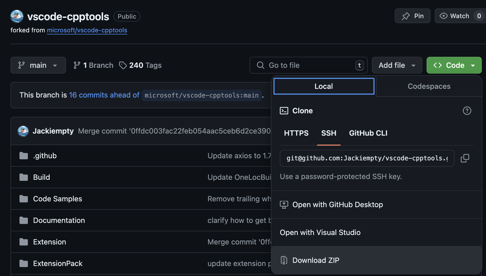
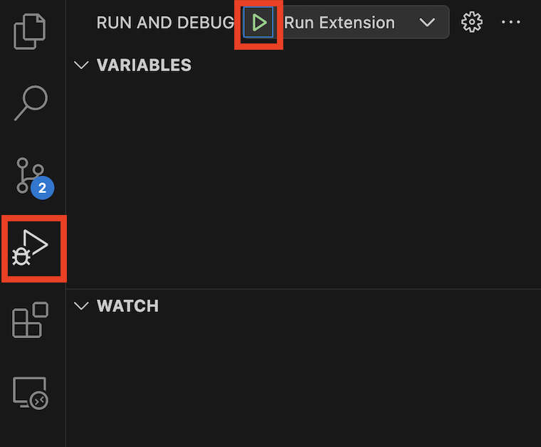
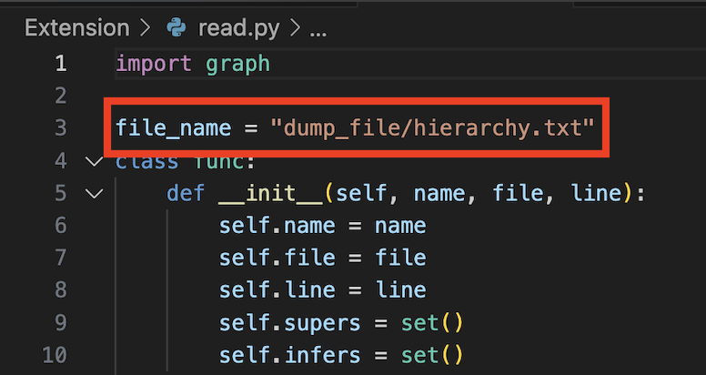
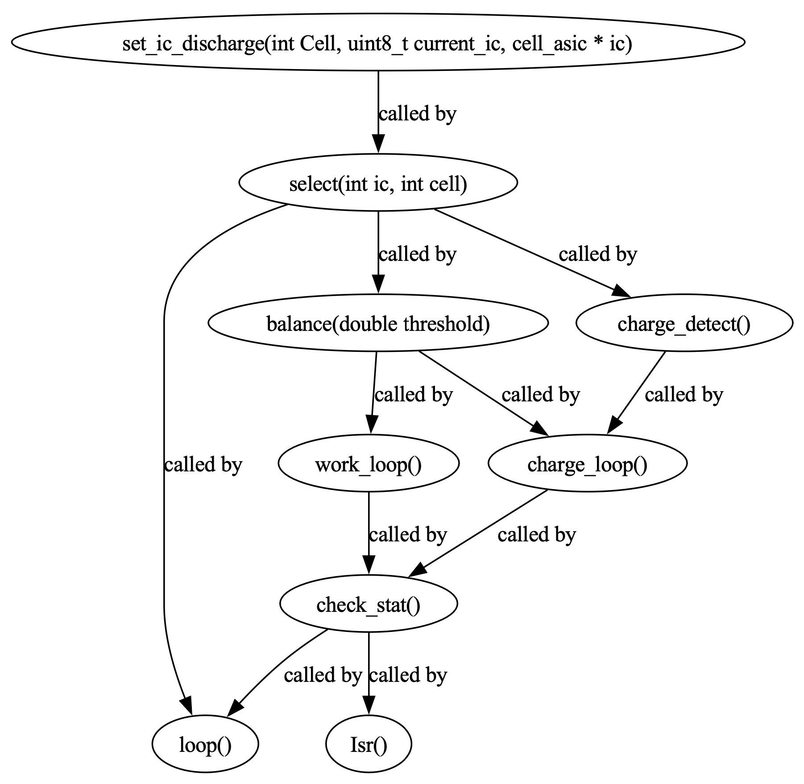

# Find Hierarchy & Show all Reference file dump 
**Outline:**  
* Prerequisite
* 下載專案
* 專案建置
* 前端處理
* 後端處理

# Prerequisite
* VS code：  
Extension 所運行的平台，也是很好用的編輯器，而且開源
* Node.js：  
運行 Javascript / Typescript 所需要的環境
* Npm：  
Javascript package manager, the equivalent of pip of Python as to Javascript
* Git：  
版控系統，主要是改好的版本我放在 [Github](https://github.com/Jackiempty/vscode-cpptools.git)，以便管理以及做不同版本間的程式比對
* Graphviz:  
圖像化工具，可以將`txt`檔之中的函示階層關係透過專屬語法描述之後視覺化，幫助更直觀的了解

# 下載專案
點選 Download ZIP，當然如果你有安裝 Git 也可以用 clone repository 的方式  
  

如果你是下載 ZIP，則請你解壓縮  

**Git clone command:**
```shell
$ git clone https://github.com/Jackiempty/vscode-cpptools.git
```

# 專案建置

1. 打開 VS code
2. 選取 `path/to/cpp-tools/Extensions` 作為 Workspace 資料夾，因為要建置的 extionsion 主體在這
3. 先用 npm 下載 yarn  
```shell
$ npm install -g yarn
```
4. **Run and Debug** 直接按下去
5. 看 npm 套件缺什麼就裝什麼  
```shell
$ npm install -g <package_name>
```

  

6. 重複`4, 5`兩個步驟直到成功建置為止
7. 有時在 console 會問你要不要授權裝什麼，打 yes + enter 就可以了

# 前置步驟
1. 這邊我們暫時沒有像樣一點的輸入介面，只能手動點選想要查找的對象
2. 對你想要查找的函式/變數用滑鼠連點兩下左鍵
3. 按右鍵
4. 找到 Show call hierarchy/Find all reference 按下去
5. 耐心等待 cpp-tools-extension 做資料處理 (由於同步執行流程要一一走訪每個檔案需要一段時間)
6. 當右下角的圈圈沒有再轉就代表已經找完了

# 後端處理
在查找結束後，會在 `Extension/dump_file/` 底下找到 `hierarchy.txt` 或 `reference.txt`，這時裡面會有像圖片裡這樣的文字  

  
> hierarchy.txt 裡面的樣子

從文字的排版方式可以看出每個函式之間的階層上下關係，透過縮排區分，但光這樣還是需要自己人工去過濾掉重複的函式，因此這個形式的資料還不夠精練  

  
> reference.txt 裡面的樣子，包含的資訊有：  
> 第一行：函式/變數名稱，所在檔案路徑以及名稱，函式所在行數

## 使用 read.py 讀取並解析 hierarchy.txt
為了解析 hierarchy.txt 裡面的 raw data，我寫了一個小工具可以將裡面的內容可視化，讓使用者可以一目瞭然所有函式之間的呼叫/被呼叫關係  

  
> 這裡可以更改你想要畫圖的檔案路徑 + 名稱，但如果你不先到 CallHierarchyProvider.ts 裡面去改輸出的檔案路徑 + 名稱的話，他預設就會是這個樣子，正常情況不會去動到  

```shell
$ python3 read.py
```
在執行完這行命令後，`Extension/dump_file/`會再跑出兩個檔案，分別是`*.gv`和`*.pdf`，前者的內容是透過`Graphviz`套件將在`python`程式中描述好的函式之間的關係自動生成透過專屬語法描述的文字檔，而後者是該文字檔圖像化後所生成的 PDF 檔，供使用者存取  
## 畫出來的樣子  

  

目前能夠看到的資訊是函式名稱以及彼此之間的呼叫/被呼叫關係，由於在程式裡面是有將檔案位置和行數都作為物件屬性儲存起來的，所以若是有想要在上面也加上這些資訊的話也是可以的，但目前為了版面整潔著想，並沒有那麼做。 

## 最後的最後
如果你要再進行一次查找的話，記得將原本檔案裡面的內容刪掉並關閉檔案，原因如下：  
* 它的寫檔函式是透過疊加的方式寫進去的，不會覆寫原本的內容，所以如果你沒有刪掉原本的內容就再寫新的東西的話，裡面就會存在兩筆資料，再寫的話以此類推，所以如果你每次都只需要一個函式的資料的話，記得刪掉前面的內容  
* 它的寫檔函式是會在取用這個檔案的時候讓這個檔案保持開啟的狀態，而如果你沒有先關掉這個檔案的話等於目前的主控權在你手上，函式就會無法取用，導致沒辦法寫資料進去，所以記得在查找新的函式之前先關掉你可能已經打開的文字檔  